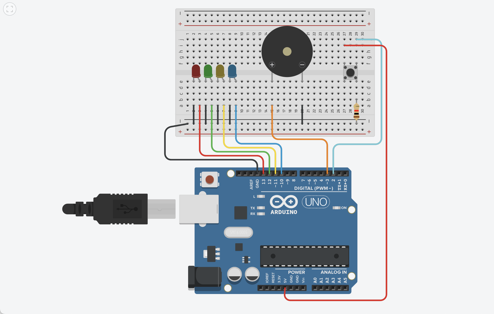

# Morse Code Input Device with Arduino

This project is a **Morse Code Input System** built using an Arduino. It allows users to input characters (like A–Z and 0–9) by pressing a **single button**, mimicking Morse code signals. Based on the pattern (short or long presses), characters are identified and printed via the **Serial Monitor**, allowing users to type out full messages.

---

## 🔧 Features

- Input characters using a **single push button** (Morse code style).
- Visual and audio feedback using **LEDs and a buzzer**.
- Automatic character detection based on **press duration**:
  - Short press = dot `*`
  - Long press = dash `-`
- Recognizes pauses to determine character and word separation.
- Prints characters to the **Serial Monitor**.

---

## 🛠 Hardware Components

- Arduino Uno (or compatible)
- Push Button
- 4x LEDs (for visual feedback)
- Buzzer (for audio feedback)
- Resistors
- Breadboard & jumper wires

---

## ⚙️ Pin Configuration

| Component     | Arduino Pin |
|---------------|--------------|
| Button        | 2            |
| LED (Dot)     | 13           |
| LED (Dash)    | 12           |
| LED (Char)    | 11           |
| LED (Space)   | 10           |
| Buzzer        | 3            |

---

## 🧠 How It Works

- When the **button is pressed**, the duration is measured:
  - If pressed for a short time → considered a **dot** (`*`)
  - If pressed longer → considered a **dash** (`-`)
- The buzzer and LEDs give feedback during input:
  - High tone for dot, low tone for dash
  - LED indicators distinguish between dot and dash
- When a pause is detected:
  - After a short pause → the current Morse sequence is translated into a character
  - After a longer pause → interpreted as a **space between words**
- The translated character is then printed in the **Serial Monitor**.

---

## 🧪 Morse Code Support

This version currently supports the **English alphabet (A–Z)**. You can extend it to include numbers (0–9) by adding them to the `MORSE` and `LETTERS` arrays in the `checkForLetters()` function.

---

## 🚀 Getting Started

1. Connect the components as per the pin configuration.
2. Upload the provided code to your Arduino using the Arduino IDE.
3. Open the Serial Monitor (9600 baud).
4. Start pressing the button in Morse code:
   - Short press (`<300ms`) = dot (`*`)
   - Long press (`>=300ms`) = dash (`-`)
5. Pause briefly to generate characters. Pause longer to insert spaces.

---

## 📝 Notes

- Adjust timing thresholds (`longSignalLength`, `pauseLength`, `spacePauseLength`) to suit your input speed.
- You can modify the `MORSE` and `LETTERS` arrays to include more characters like numbers and punctuation.

---

## 📚 License

This project is open-source and free to use under the MIT License.

---
